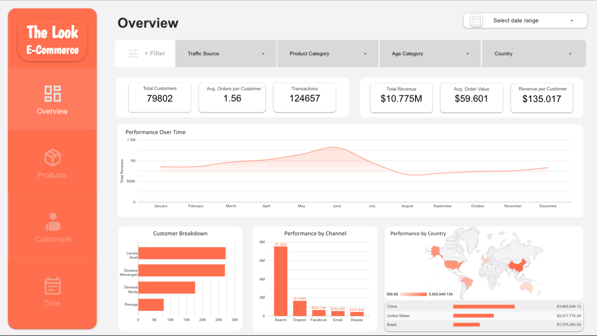
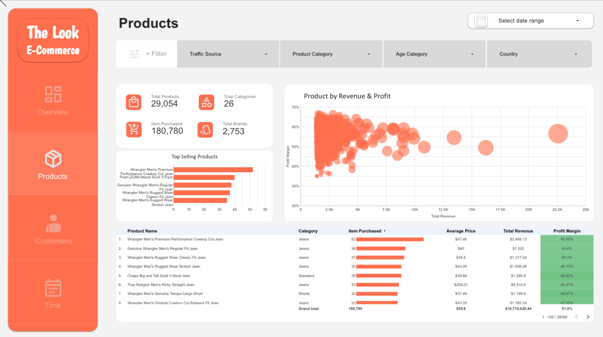
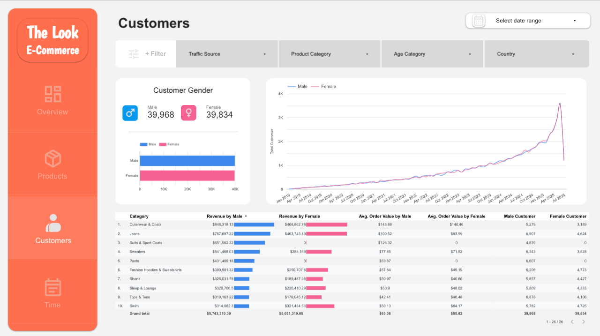

# E-commerce Sales Dashboard - The Look Analytics Project

## 🚀 Live Dashboard

[](https://lookerstudio.google.com/reporting/a212e3ac-7752-4385-8ae0-2ff248262636/page/p_iqqp9qe2td)

---

## 📖 Project Overview

Proyek ini bertujuan untuk menganalisis data penjualan dari "The Look", sebuah perusahaan e-commerce fiktif. Tujuannya adalah untuk membangun sebuah dashboard interaktif yang dapat digunakan oleh tim manajemen untuk memonitor Key Performance Indicators (KPI) dan menemukan insight strategis terkait performa produk, demografi pelanggan, dan efektivitas kanal pemasaran. Seluruh proses, mulai dari transformasi data hingga visualisasi, dilakukan menggunakan ekosistem Google Cloud Platform.

---

## 🛠️ Tech Stack

* **Data Transformation**: Google BigQuery (SQL)
* **Data Visualization**: Looker Studio
* **Dataset**: `thelook_ecommerce` (Public Dataset di BigQuery)

---

## ⚙️ Alur Kerja Proyek

Proyek ini dibagi menjadi dua tahap utama:

### 1. Data Preparation & Transformation (BigQuery)

Tahap ini berfokus pada pembersihan, penggabungan, dan rekayasa fitur (feature engineering) dari data mentah untuk membuat satu tabel utama yang siap untuk dianalisis.

* **Penggabungan Data**: Menggabungkan 5 tabel sumber (`orders`, `order_items`, `users`, `products`, `inventory_items`) menggunakan `LEFT JOIN` untuk menciptakan satu sumber data yang komprehensif.
* **Feature Engineering**: Membuat kolom-kolom kalkulasi baru untuk analisis yang lebih dalam, seperti:
    * `profit`: Menghitung keuntungan per item.
    * `processing_duration_days`, `shipping_duration_days`: Menghitung durasi operasional.
    * `age_category`: Mengelompokkan usia pelanggan ke dalam segmen.
    * `is_returned`: Flag boolean untuk item yang diretur.
* **Pembersihan Data**: Memfilter data - data yang tidak relevan (pesanan di masa depan) untuk memastikan analisis yang akurat.

<details>
<summary>Lihat Kode Final SQL di BigQuery</summary>

```sql
-- SALIN DAN TEMPEL KODE FINAL BIGQUERY ANDA DI SINI
CREATE OR REPLACE VIEW `nama_project.nama_dataset.ecommerce_analytics_view` AS
WITH
  ecommerce_main_data AS (
    -- ... Seluruh query Anda yang sudah diperbaiki ada di sini ...
  )
SELECT * FROM ecommerce_main_data;
```

</details>

### 2. Data Visualization & Analysis (Looker Studio)

Data yang telah diolah kemudian divisualisasikan dalam sebuah dashboard interaktif 4 halaman di Looker Studio. Setiap halaman dirancang untuk menjawab pertanyaan bisnis spesifik.

---

## 📊 Dashboard & Key Insights

### Halaman 1: Overview
Halaman ini memberikan ringkasan kinerja bisnis secara keseluruhan.



* **Pertanyaan Bisnis**: Bagaimana kinerja penjualan, siapa pelanggan kita, dan dari mana sumber pendapatan terbesar?
* **Key Insights & Recommendations**:
    * **Insight**: Kanal 'Search' menjadi pendorong revenue terbesar, namun kanal 'Email' memiliki Average Order Value (AOV) yang lebih tinggi.
    * **Rekomendasi**: Lakukan kampanye retargeting melalui email kepada pelanggan yang sudah ada dengan menawarkan produk komplementer untuk meningkatkan nilai transaksi.

### Halaman 2: Products
Halaman ini berfokus pada analisis kinerja portofolio produk.



* **Pertanyaan Bisnis**: Produk dan kategori mana yang paling laku dan paling menguntungkan?
* **Key Insights & Recommendations**:
    * **Insight**: Scatter plot menunjukkan bahwa banyak produk populer (revenue tinggi) memiliki profit margin yang rendah. Produk dalam kategori "Jeans" secara konsisten menunjukkan profitabilitas dan volume penjualan yang tinggi.
    * **Rekomendasi**: Lakukan analisis biaya pada produk bervolume tinggi dengan margin rendah untuk mencari peluang efisiensi. Prioritaskan stok dan promosi untuk produk "star" seperti pada kategori "Jeans".

### Halaman 3: Customers
Halaman ini menganalisis demografi dan perilaku pelanggan.



* **Pertanyaan Bisnis**: Bagaimana perbedaan profil dan perilaku belanja antara pelanggan pria dan wanita?
* **Key Insights & Recommendations**:
    * **Insight**: Komposisi pelanggan hampir seimbang 50/50 antara pria dan wanita. Namun, data menunjukkan pelanggan pria cenderung memiliki AOV sedikit lebih tinggi, terutama pada kategori "Outerwear & Coats".
    * **Rekomendasi**: Buat kampanye marketing yang ditargetkan secara spesifik untuk koleksi "Outerwear & Coats" kepada audiens pria menjelang musim tertentu.

### Halaman 4: Time
Halaman ini menganalisis tren dan performa dari waktu ke waktu.


* **Pertanyaan Bisnis**: Bagaimana tren pertumbuhan bisnis dan efisiensi konversi secara bulanan?
* **Key Insights & Recommendations**:
    * **Insight**: Terdapat lonjakan revenue yang sangat signifikan pada Juli 2025. Hal ini menunjukkan adanya data outlier atau event penjualan masif yang tercatat.
    * **Rekomendasi**: Dalam skenario bisnis nyata, outlier ini harus menjadi prioritas investigasi untuk divalidasi. Untuk analisis tren yang normal, periode ini sebaiknya dikecualikan.

---
